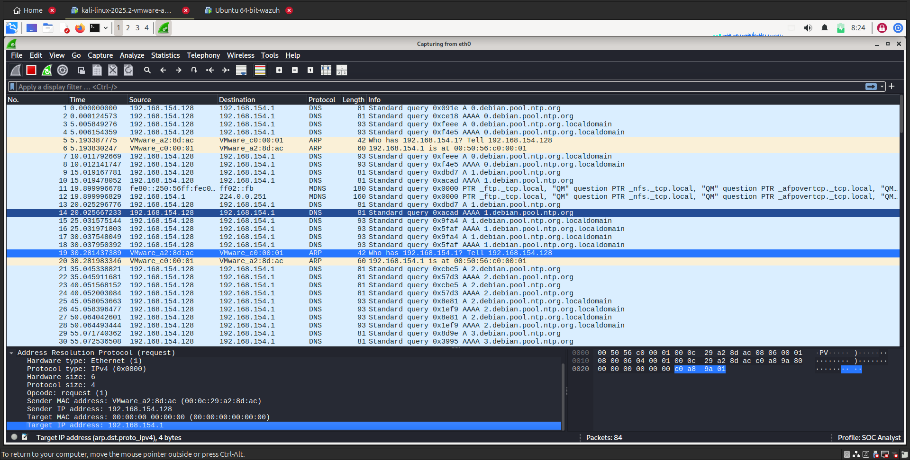

## Exercise 2: Traffic Analysis with Wireshark

**Objective**: Capture and analyze network traffic to identify potential security issues.

### Steps

1. **Install Wireshark**:
    ```bash
    sudo apt-get install wireshark
    ```

2. **Capture Network Traffic**:
    - Open Wireshark.
    - Select the network interface you want to monitor.
    - Click **Start** to begin capturing packets.

3. **Analyze Captured Traffic**:
    - Look for suspicious patterns such as:
      - Repeated requests from the same IP
      - Unusual protocols
      - Large or unexpected data transfers

### Expected Output
- A capture file containing network traffic data.
- Identification of any suspicious traffic patterns.

### Lab Snapshot


This snapshot shows the captured network traffic, highlighting potential anomalies and patterns identified during the analysis.

### Conclusion
By completing this exercise, I learned how to capture and analyze network traffic using Wireshark. I was able to identify suspicious patterns, unusual protocols, and potential security issues within the network. This hands-on practice helps build foundational skills for network monitoring, threat detection, and overall network security assessment.
