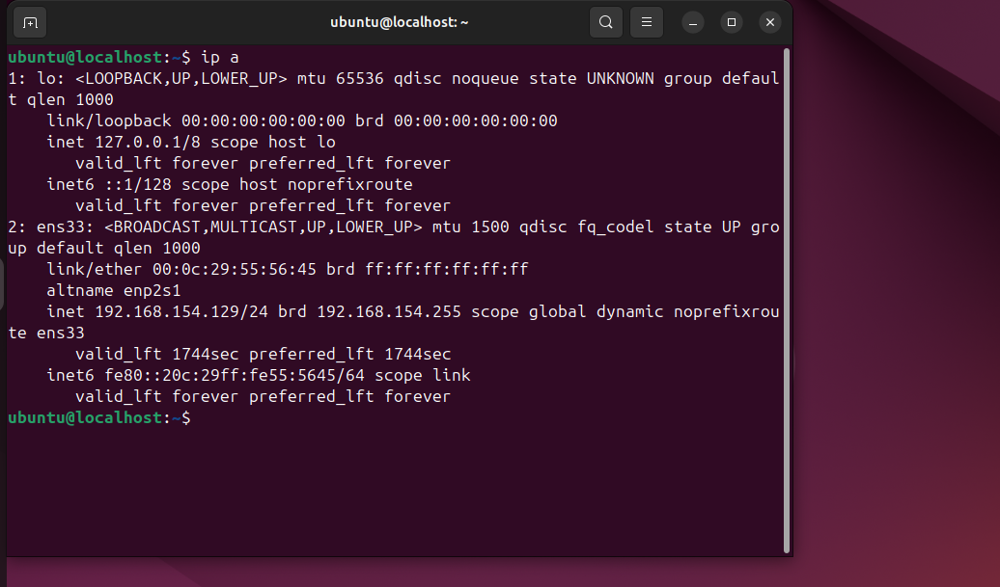
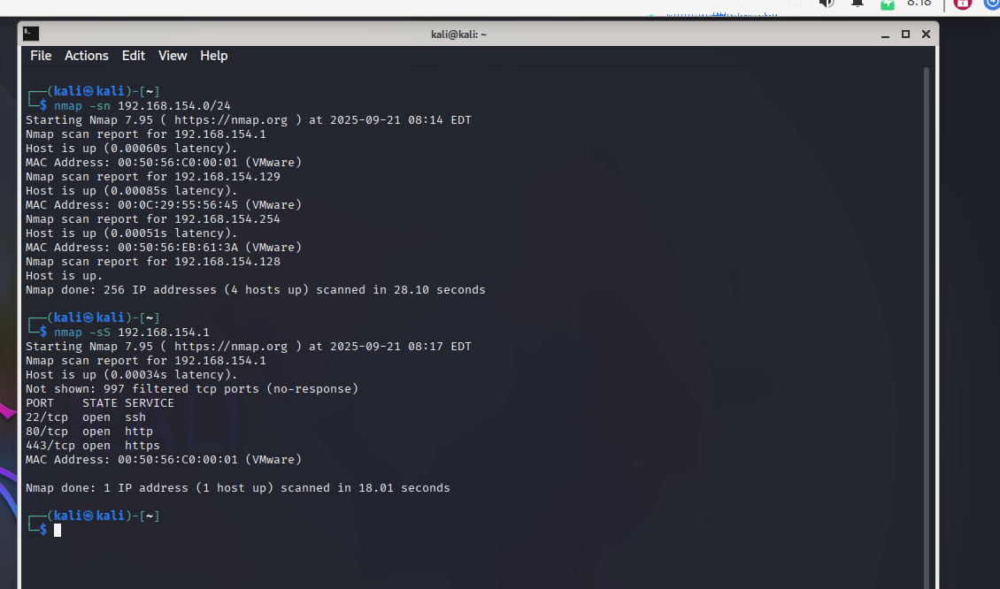

# Basic Network Security Assessment: Identifying Vulnerabilities in Network Configurations

## Lab Setup

**Virtual Machines**:
- **Attacker:** Kali Linux (VMware)
- **Target:** Ubuntu (VMware)

**Network Configuration**:
- Both VMs are connected on the same isolated network in VMware.
- IP addresses observed:
snap -> 

  - Kali Linux (Attacker): `192.168.154.129`
  - Ubuntu (Target): `192.168.154.1`
  - Other hosts on the network:
    - `192.168.154.128`
    - `192.168.154.254`

---

## Exercise 1: Network Scanning with Nmap

**Objective**: Identify live hosts and open ports on the target network.

### Step 1: Ping Scan for Live Hosts
Command:
```bash
nmap -sn 192.168.154.0/24


Nmap scan report for 192.168.154.1
Host is up (0.00006s latency).
MAC Address: 00:50:56:C0:00:01 (VMware)

Nmap scan report for 192.168.154.129
Host is up (0.00085s latency).
MAC Address: 00:0C:29:55:56:45 (VMware)

Nmap scan report for 192.168.154.254
Host is up (0.00051s latency).
MAC Address: 00:50:56:EB:61:3A (VMware)

Nmap scan report for 192.168.154.128
Host is up

```

Observation: 4 live hosts were found in the subnet.

Step 2: Scan Selected Host for Open Ports

Command:
nmap -sS 192.168.154.1

PORT    STATE SERVICE
22/tcp  open  ssh
80/tcp  open  http
443/tcp open  https

MAC Address: 00:50:56:C0:00:01 (VMware)

snap 

Observation:

The target host 192.168.154.1 has SSH, HTTP, and HTTPS services open.

These are potential points of entry for further testing.

## By completing this exercise, I was able to identify live hosts on the subnet and detect open ports/services on the target machine. This step is fundamental in network security assessment as it reveals potential vulnerabilities and entry points for attackers, helping to prioritize further security testing.